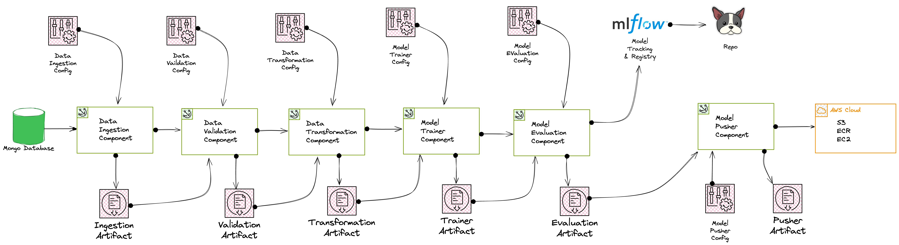

# EdgeNodes: Network Security System

EdgeNodes is a **machine learning-based phishing detection system** that identifies malicious URLs to secure edge networks from cyber threats. Using a dataset of website and URL features, the system detects whether a given site is **legitimate or phishing**.

The project implements a modular **MLOps pipeline**, enabling automated ingestion, validation, transformation, training, evaluation, and deployment of phishing detection models. Models are tracked via **MLflow** and deployed to **AWS Cloud** for real-time inference.

---
## 🏗️ Architecture



The pipeline consists of: **Data Ingestion → Validation → Transformation → Training → Evaluation → Deployment** with artifact tracking and MLflow integration.

---

## 🚀 Features

* **Automated Data Pipeline**: Ingests phishing dataset with URL-based features.
* **Data Validation**: Ensures schema integrity, missing value checks, and consistency.
* **Data Transformation**: Feature engineering and preprocessing for model training.
* **Model Training**: Trains ML models to classify URLs as *phishing* or *legitimate*.
* **Model Evaluation**: Evaluates model performance using precision, recall, F1, and AUC.
* **Model Registry & Tracking**: Uses **MLflow** for experiment tracking, versioning, and reproducibility.
* **Model Deployment**: Pushes validated models to **AWS Cloud (S3, ECR, EC2)** for scalable deployment.
* **Artifacts Management**: Each stage generates artifacts for traceability and reproducibility.

---

## 📊 Dataset

The system is trained on a **phishing website dataset** consisting of **11,055 samples** with **30 features** describing website/URL behavior.

* **Features include:**

  * `having_IP_Address`, `URL_Length`, `SSLfinal_State`, `Domain_registeration_length`, `Page_Rank`, `Google_Index`, etc.
* **Target label:**

  * `Result = -1` → Phishing website
  * `Result = 1` → Legitimate website

---

## 🧠 Model Performance

The best-performing model selected was:

**`RandomForestClassifier`**

| Metric        | Train Score | Test Score |
| ------------- | ----------- | ---------- |
| **F1-score**  | 0.9910      | 0.9776     |
| **Precision** | 0.9887      | 0.9717     |
| **Recall**    | 0.9933      | 0.9836     |

✅ The results show strong generalization with **high recall**, making it effective at catching phishing websites without missing many.

---

## ⚙️ Tech Stack

* **Languages & Frameworks**: Python, Scikit-learn, XGBoost
* **Dataset**: Phishing Website Dataset (URL-based features)
* **MLOps Tools**: MLflow (tracking & model registry)
* **Cloud Deployment**: AWS (S3, ECR, EC2)
* **Containerization**: Docker

---

## 📦 Installation

```bash
# Clone repository
git clone https://github.com/yourusername/EdgeNodes.git
cd EdgeNodes

# Create virtual environment
python3 -m venv .venv
source .venv/bin/activate   # On Windows use .venv\Scripts\activate

# Install dependencies
pip install -r requirements.txt
```

---

## ▶️ Usage

1. **Configure pipeline**

   * Edit YAML configs under `configs/` (ingestion, validation, transformation, trainer, evaluation, pusher).

2. **Run pipeline**

   ```bash
   python main.py
   ```

3. **Monitor experiments**

   * Start MLflow UI:

     ```bash
     mlflow ui
     ```
   * Visit `http://127.0.0.1:5000`

4. **Deploy model**

   * Models are pushed to AWS (S3, ECR, EC2).

---

## 📂 Project Structure

```
EdgeNodes/
│── configs/                # Configuration files
│── data/                   # Dataset
│── artifacts/              # Generated artifacts from pipeline
│── src/                    # Source code
│   ├── ingestion/
│   ├── validation/
│   ├── transformation/
│   ├── trainer/
│   ├── evaluation/
│   ├── pusher/
│── tests/                  # Unit tests
│── requirements.txt        # Dependencies
│── main.py                 # Pipeline orchestrator
│── README.md               # Documentation
```

---

## 🌐 Deployment

Models are deployed on **AWS Cloud**:

* **S3** → Model storage
* **ECR** → Containerized model registry
* **EC2** → Serving predictions

---

## 📊 Monitoring

* **MLflow**: Tracks experiments, hyperparameters, metrics, and artifacts.

---

## 📜 License

This project is licensed under the MIT License. See `LICENSE` for details.

---

## 👨‍💻 Contributors

* **Aditya Pandey** – Developer & Architect.

